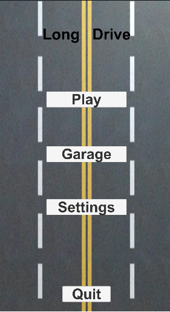
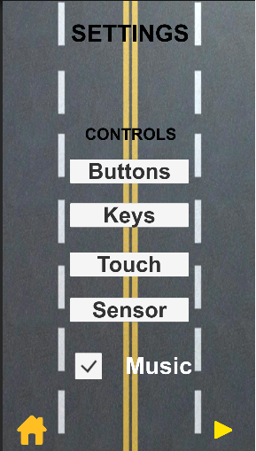

# Long Drive (WIP)

An endless longdrive game I've created, 
because personally when I'm on a long drive on my cycle it's so hard for me when to finish it and return back home

## Gameplay

It is still in the development but the basic gameplay is something like this:
- From the garage, you get to choose the car you want to drive. 
- On the road, there are different vehicles ready to give you the thrill to drift and overtake. 
- To not end your long drive, you need to maintain the health of your car by avoid colliding with other vehicles and collecting fuel cans. 

## Features 

- Different cars can be chosen from the garage system. (The money system is still in progress for the garage system)
- Car can be controlled via different input systems 1.buttons(pc&mobile) 2.keyboard keys(pc) 3.touch(mobile) 4.sensor(mobile) 
- You can also accelerate or deaccelerate the car

## Demo

             

https://user-images.githubusercontent.com/42877499/145081422-d29a8b6e-bc0c-45b3-88fa-059ba84e573f.mp4 

https://user-images.githubusercontent.com/42877499/145082947-3083b4dd-4243-4ea3-acca-5bfad5343fc3.mp4
